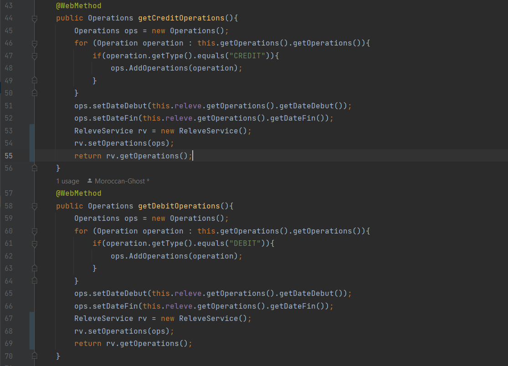
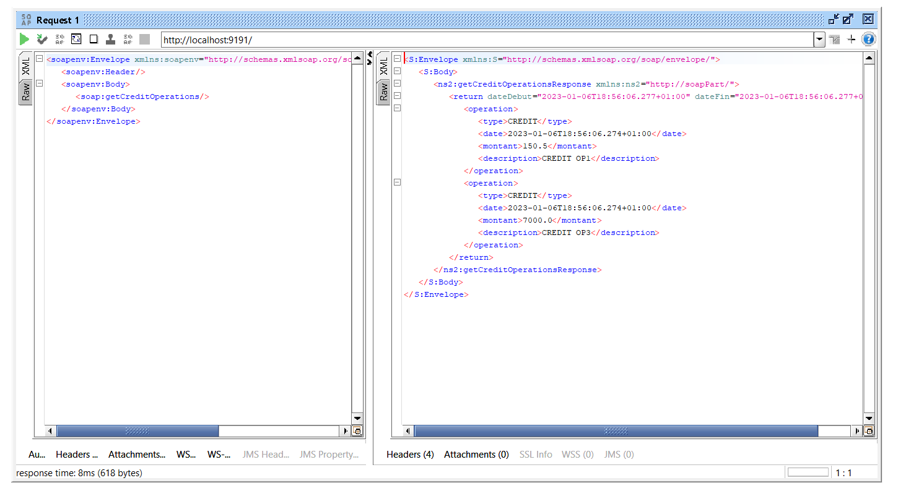
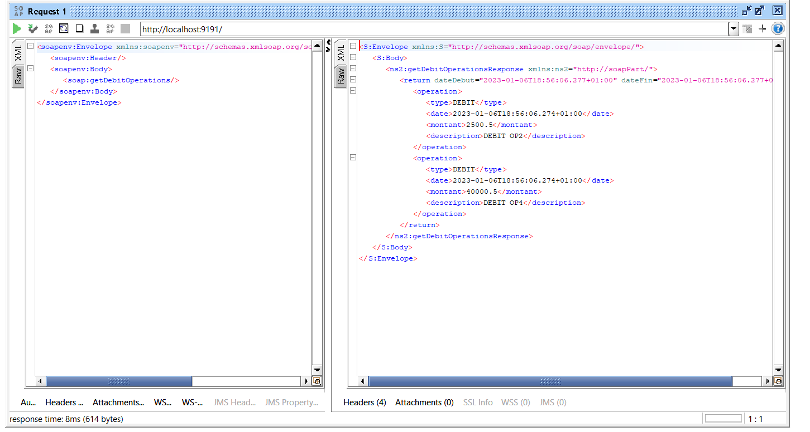

# Examen_XML_WebService

    

    <h3>A. Partie Technologie XML :</h3>
    
Code of this part exist in <a href="https://github.com/Moroccan-Ghost/Examen_XML_WebService/tree/master/src/XmlPart">XmlPart</a> : <b>/src/XmlPart</b>

    Screens : 
    <ul>
        <li>
            DTD : 
            
        </li>
        <li>
            XML valid by DTD : 
            
            
        </li>
        <li>
            XSD :
            
            
        </li>
        <li>
            XML valid by XSD : 
            
            
        </li>
        <li>
            XSL:
            
            
            
            
            
        </li>
    </ul>
    

    

    <h3>B. Partie Mapping Objet XML avec Jax Binding :</h3>
    <ul>
        <li>
           Q1 and Q2 : Operation && Operations && Releve all those class are <a href="src/main/mappingObject/operationServices">HERE</a>
        </li>
        <li>
            Q3 : <a href="src/main/mappingObject/Serialize.java">Serialize</a> :
            
            Result : 
            
        </li>
        <li>
            Q4 : <a href="src/main/mappingObject/deserialize.java">Deserialize</a> :
            
            Result : 
            
        </li>
        <li>
            Q5 : <a href="src/main/mappingObject/generateSchema.java">GenerateSchema</a> :
            
            Result : 
            
        </li>
    </ul>
    

    

    <h3>C && E. Partie Web services SOAP WSDL avec JaxWS + des fonctionnalités supplémentaires</h3>
    <ul>
        <li>
            WebService : <a href="src/main/mappingObject/soapPart/releveWS.java">HERE</a>
            
            
            
        </li>
        <li>
            Server : <a href="src/main/mappingObject/soapPart/Server.java">HERE</a>
            
            
        </li>
        <li>
            WSDL :
            
        </li>
        <li>
            Client : <a href="src/main/mappingObject/soapPart/Client.java">HERE</a>
            
            
        </li>
        <li>
            SOAPUI test :  
             
            getOperations : 
            
            getRib : 
            
            getSolde : 
            
            get releveWS : 
            
        </li>
        <li>
            getCreditOperations && getDebitOpeations after Modification : 
             
        </li>
        <li>
            Test of getCreditOperations && getCreditOperations with SOAPUI :  
            
            
        </li>
    </ul>
    

