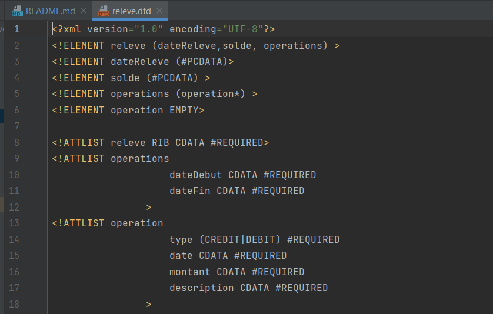
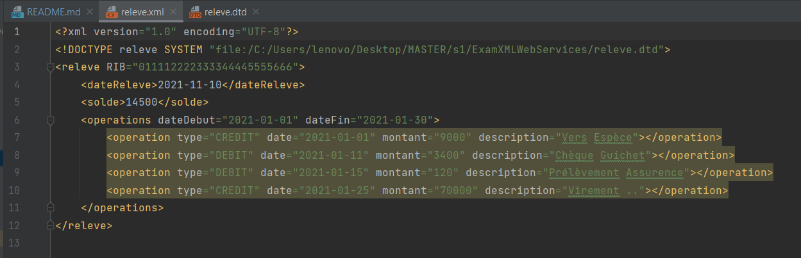
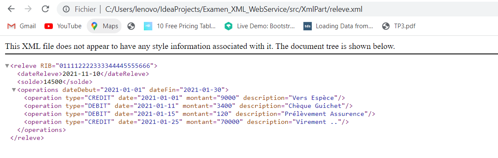
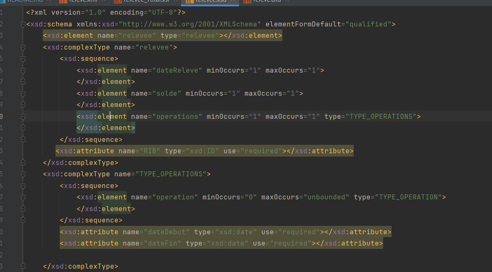
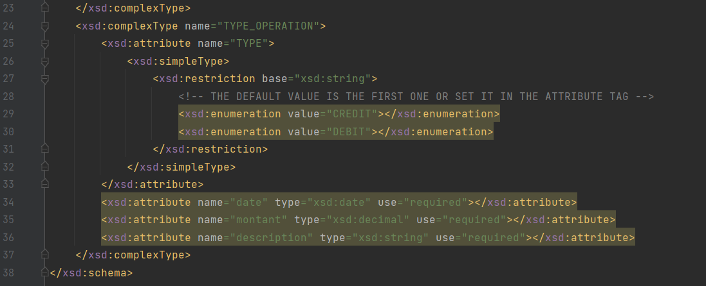
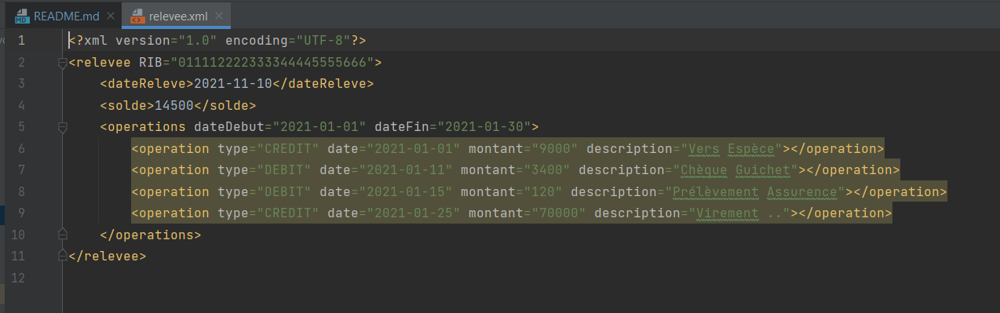
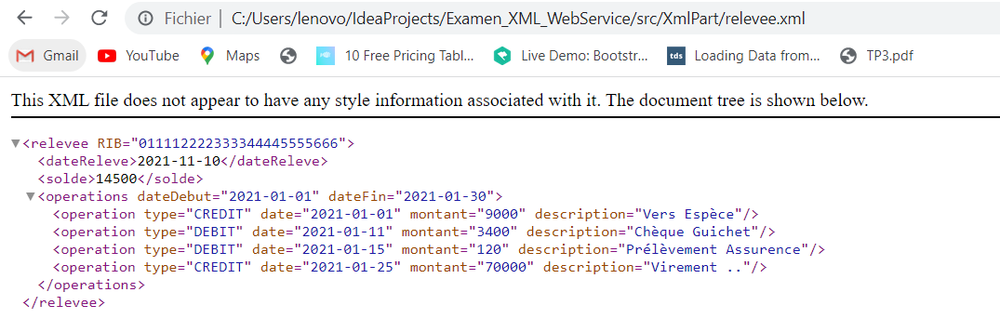

# Examen_XML_WebService

<h3>A. Partie Technologie XML :</h3>

Code of this part exist in <a href="https://github.com/Moroccan-Ghost/Examen_XML_WebService/tree/master/src/XmlPart">XmlPart</a> : <b>/src/XmlPart</b>

Screens : 
<ul>
    <li>
        DTD : 
        
    </li>
    <li>
        XML valid by DTD : 
        
        
    </li>
    <li>
        XSD :
        
        
    </li>
    <li>
        XML valid by XSD : 
        
        
    </li>
</ul>

